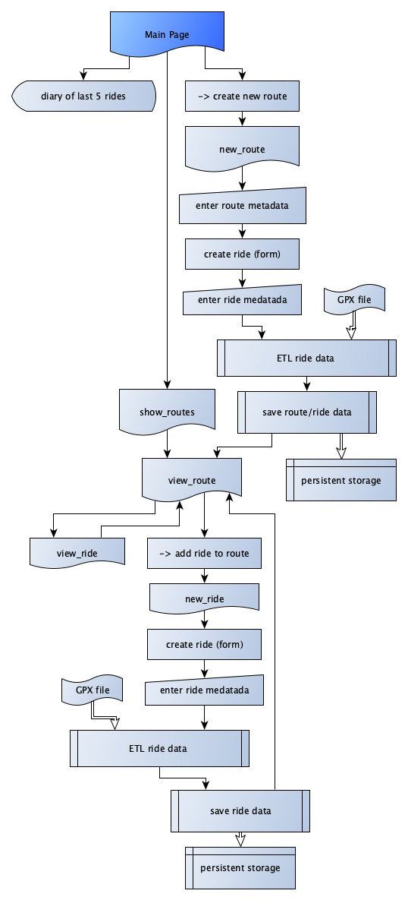

# track-rides
Das Velotagebuch für deine Fahrten

## Problembeschreibung/Motivation
### Warum dieses Projekt
- Ich fahre gerne Velo und zeichne meine Fahrten jeweils mit der GPS-Uhr auf
- Dabei erhalte ich GPX-Datein mit vielen interessanten Daten zur Fahrt
- Es existieren verschiedene Dienste, wo diese hochgeladen werden können (Komoot, Strava, Garmin connnect)
- Dies sind jedoch bezüglich problematisch bezüglich der Privatsphäre und erlauben es nicht einzelne Fahrten der gleichen Strecke miteinander zu vergleichen

### Welches Problem löst das Projekt
Track-rides erlaubt es in einer Web-App auf dem eigenen Rechner seine GPX-Dateien zu erfassen und so die eigene Entwicklung beim Velofahren zu verfolgen, ohne die Daten an andere anbieter zu senden.

### Was macht das Projekt
Track-rides ist ein Velotagebuch für die erfassung der eigenen Fahrten mittels GPX-Dateien. Diese werden jeweils unter Strecken zusammengefasst und bieten so die möglichkeit die eigene Entwicklung zu vergleichen. 
Die Strecken können unterschiedlichen Typen zugeordnet werden: Z.b. Training, Pendeln und Rennen. Track-rides zeigt für jede Fahrt die gefahrene Strecke auf einer Karte an, sowie Kurven für Geschwindigkeit, Höhenmeter und Herzfrequenz

## Betrieb
### Benötigte Python Module
Das Paket besitzt folgende Abhängigkeiten, welche vor start installiert werden müssen
- Python (getestet mit 3.9)
- babel
- flask
- folium
- gpxpy
- json
- matplotlib
- numpy
- pandas
- plotly
- vincenty

### Was muss man bei der Ausführung beachten. Was muss eventuell davor noch gemacht werden
Das Programm benötigt Dateien im GPX-Format. Für die Erfassung der Herzfrequenz werden aktuell nur Daten von Garmin-Sportuhren unterstützt, da es sich dabei um eine proprietäre Erweiterung des GPX-Standards handelt. 

### Welch Datei muss ausgeführt werden
das Programm wird mit ausführung von **main.py** gestartet 

## Benutzung
### Wie wird das Projekt benutzt
Nach Starten des Programm öffnet man die Seite im http://127.0.0.1:5000/ im Browser. Dies ist die Hauptseite von der man Mittels Navigation auf die restlichen Seiten kommt. Als erstes sollte eine Strecke erfasst werden und die erste GPX-Datei hochgeladen werden.

### Welche Optionen oder auch Spezialitäten existieren

## Architektur

## Ungelöste/unbearbeitete Probleme
### Was wurde nicht gelöst
- Ausreissern in gpx-Dateien werden nicht korrigiert. Diese sind anscheinend auf Fehlerhafte Messwerte zurückzuführen, welche korrigiert/entfernt werden müssten.
   - Ein Beispiel ist eine der Fahrten um den Zürichsee, welche ein Peak von 94 km/h enthält, welche dort sicher nicht gefahren wurde.
- Die Fahrten können noch nicht direkt verglichen werden, dies würde zusätzliche vergleichsmöglichkeiten benötigen

### Welche Verbesserungen könnten noch gemacht werden.*

- Da das Speichern von Herzfrequenzdaten in GPX-dateien nicht standartisiert ist, funktioniert dies aktuell nur mit Garmin-GPX Dateien. Für andere Dateien muss das einlesen erweitert werden angepasst werden (siehe https://github.com/tkrajina/gpxpy/issues/119 für Details). 
- Track-rides enthält code von gpxo v0.1.6 https://github.com/ovinc/gpxo. Dieser ist im Verzeichnis gpxo zu finden
   - Der Code wurde integriert, damit die Klasse Track gleich um die Herzfrequenzdaten ergänzt werden kann
   - Wahrscheinlich wäre es möglich, dies mit __init__ on the fly zu machen, was meine aktuellen Python-Kenntnisse aber übersteigt.
   - Am saubersten wäre es aber, das gpxo um allgemein formulierte Herzfrequenzdatenfunktionen zu ergänzen und dies Upstream zu pushen. Dafür fehlt mir aber aktuell die Zeit
   - gpxo verwendet mpleaflet um karten zu rendern. Mpleaflet wird leider nicht mehr aktiv maintained (letzer Commit 2018, letzter release 2015), und Funktioniert nicht mehr mit aktuellen Versionen von matplotlib. Deshalb wurde der mpleaflet code auskommentiert und die Abhängigkeit entfernt 
- Wie erwähnt wäre ein direkter Vergleich zwischen den Fahrten noch schön. 
- Am besten wäre es, wenn die Entwicklung über den Zeitverlauf noch visualisiert werden könnte 
- Es wird nicht verglichen ob es sich bei den Fahrten um die gleiche handelt. Es ist somit möglich ganz unterschiedliche Fahrten bei der gleichen Strecke hochzuladen. Es wäre besser, wenn diese für einen direkten Vergleich auf die gleiche Distanz zugeschnitten werden würden. 