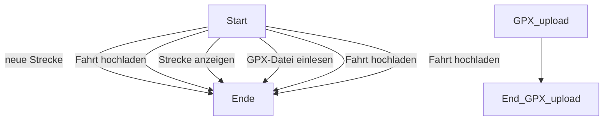

# track-rides
Track and compare your gpx-rides

## Problembeschreibung/Motivation
 - *Warum dieses Projekt*
 - *Welches Problem löst das Projekt*
 - *Was macht das Projekt*

*Lückenfüller wie: "Dieses Projekt wurde im Rahmen des XX Modules an der XXX gemacht" oder ähnlich sind unnötig. Auch sollten keine Klarnamen, oder Orte genannt werden.*
## Betrieb
 - *Welche zusätzlichen Pakete müssen bei Bedarf installiert werden. (Muss im Normalfall nicht beachtet werden. Python muss nicht erwähnt werden, da das bei einem Python Projekt impliziert ist.)*
 - Abhängigkeiten siehe: requirements.txt

 - *Was muss man bei der Ausführung beachten. Was muss eventuell davor noch gemacht werden.*
 - *Welch Datei muss ausgeführt werden*

## Benutzung
- *Wie wird das Projekt benutzt*
- *Welche Optionen oder auch Spezialitäten existieren*
- *

## Architektur
- *Hier bei Bedarf eine kurze Beschreibung des Ablaufs des Programms auf Code Ebene z.B. als Ablaufdiagramm.*

## Ungelöste/unbearbeitete Probleme
 - *Was wurde nicht gelöst*
 - *Welche Verbesserungen könnten noch gemacht werden.*
 - 

 - Da das Speichern von Herzfrequenzdaten in GPX-dateien nicht standartisiert ist, funktioniert dies aktuell nur mit Garmin-GPX Dateien. Für andere Dateien muss das einlesen erweitert werden angepasst werden (siehe https://github.com/tkrajina/gpxpy/issues/119 für Details). 
 - Track-rides enthält code von gpxo v0.1.6 https://github.com/ovinc/gpxo. Dieser ist im Verzeichnis gpxo zu finden
    - Der Code wurde integriert, damit die Klasse Track gleich um die Herzfrequenzdaten ergänzt werden kann
    - Wahrscheinlich wäre es möglich, dies mit __init__ on the fly zu machen, was meine aktuellen Python-Kenntnisse aber übersteigt.
    - Am saubersten wäre es aber, das gpxo um allgemein formulierte Herzfrequenzdatenfunktionen zu ergänzen und dies Upstream zu pushen. Dafür fehlt mir aber aktuell die Zeit
    - gpxo verwendet mpleaflet um karten zu rendern. Mpleaflet wird leider nicht mehr aktiv maintained (letzer Commit 2018, letzter release 2015), und Funktioniert nicht mehr mit aktuellen Versionen von matplotlib. Deshalb wurde der mpleaflet code auskommentiert und die Abhängigkeit entfernt 

# Neuer Input
